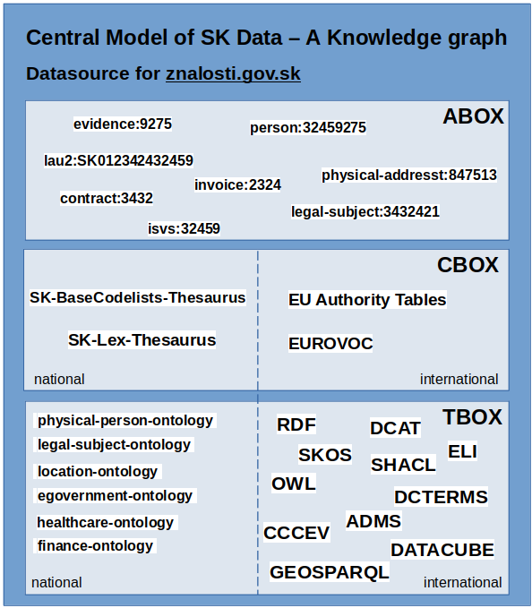

# centralny-model-udajov
Centrálny model údajov verejnej správy vo forme znalostného grafu.
Znalostný graf je aplikačne prístupný prostredníctvom portálu [znalosti.gov.sk](https://znalosti.gov.sk) 

Skladá sa z troch častí: TBOX (TerminologyBox) je množina ontológií, a doménových pravidiel, CBOX (category box) sú číselníky, hierarchite, tezauri, a ABOX(Assertions box) sú konkrétne inštančné dáta s ich hodnotami a vzájomnými vzťahmi. V rámci CMÚ sa ABOX používa na prezentáciu príkladov dát, ktoré sú popísané TBOXom a klasifikované CBOXom. 

